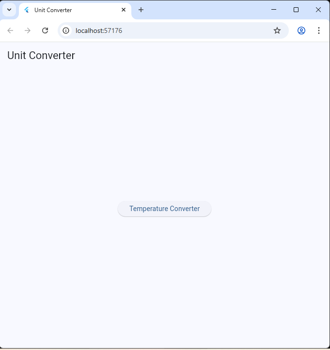
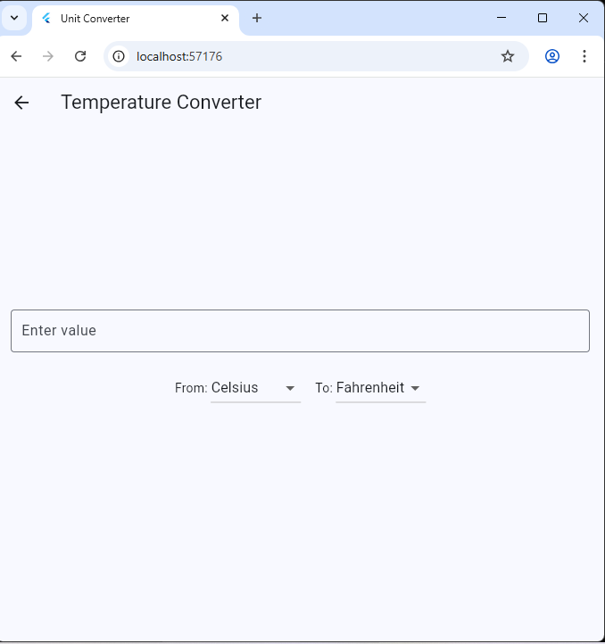
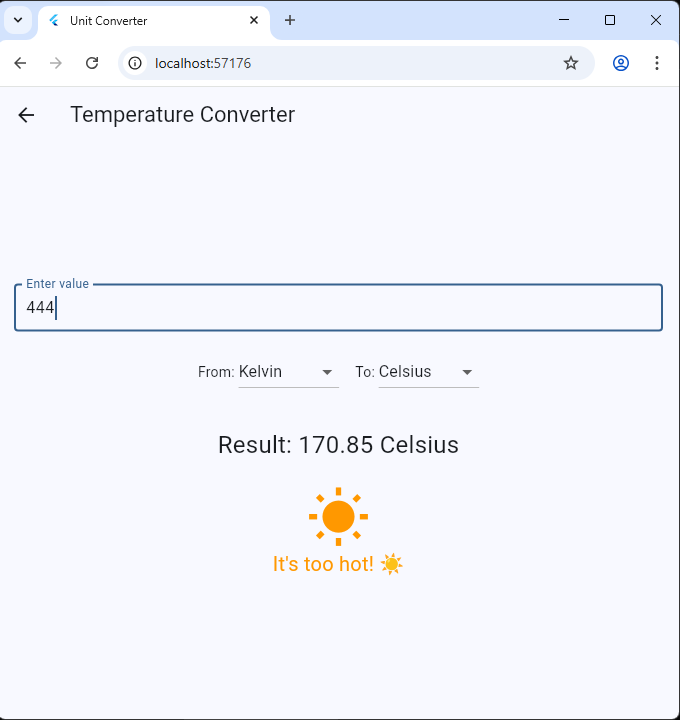
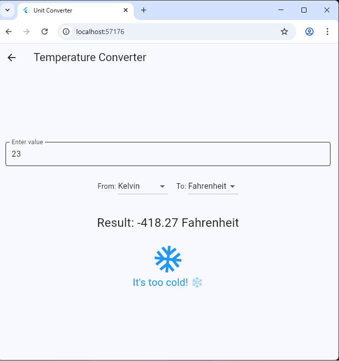

# 🌡️🔥❄️ **Unit Converter App** 🌡️🔥❄️

A simple and interactive Flutter app for converting temperatures between **Celsius**, **Fahrenheit**, and **Kelvin**.  
The app features a user-friendly interface, fun animations, and clear feedback for extreme temperatures.

---

## ✨ **Features**

- 🔄 **Convert Temperatures:**  
  Instantly convert values between Celsius, Fahrenheit, and Kelvin.

- 🖐️ **Interactive UI:**  
  Enter a value, select input and output units, and see the result update live.

- 🎉 **Animated Feedback:**  
  If the result is “too hot” or “too cold,” the app displays a fun animation and message.

- 🏠 **Navigation:**  
  The home screen lets you navigate to the temperature converter.

---

## 📸 **Screenshots**

| Home Screen | Temperature Converter | Hot Animation | Cold Animation |
|:-----------:|:--------------------:|:-------------:|:--------------:|
|  |  |  |  |

> _Replace the above image links with your own screenshots!_

---

## 🚀 **How to Use**

1. 📱 **Launch the App:**  
   Open the app on your device or emulator.

2. 🏠 **Navigate to Converter:**  
   Tap the “Temperature Converter” button on the home screen.

   

3. 🔢 **Enter a Value:**  
   Type the temperature you want to convert.

   

4. ⚙️ **Select Units:**  
   Choose the units you want to convert from and to (Celsius, Fahrenheit, Kelvin).

   

5. 👀 **View Result:**  
   The converted value appears instantly.  
   If the temperature is very hot or cold, you’ll see a sun or snowflake animation and a message.

   

---

Enjoy converting! 🌡️✨  

